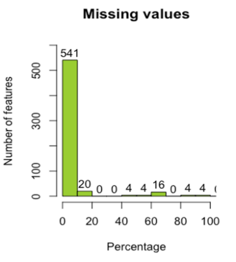
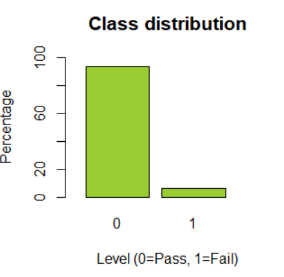
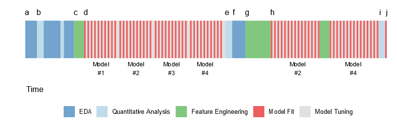
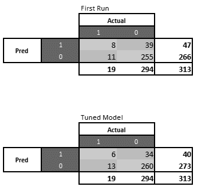
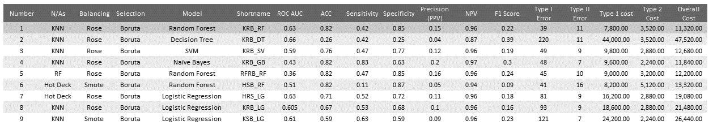

  > Project prepared by \
  > Denise Marchena \
  > Alka Parmar \
  > Tsung Han Wang\
  > Alejandro Iglesias  
  >> Extract from project [...]

# SECOM ML Case
# Predicting Quality in Semiconductor Industry
## 1	Introduction
The semiconductor manufacturing process is very complex and holds an enormous amount of data gathered from various sensors. The gathered data contains critical information regarding each produced item as well as the yield of the production line, which is vital while doing quality control of the entity. [...]
In this paper, the SECOM dataset was taken as an example of semiconductor data. This dataset obtains information regarding instances of a pass and fail, the ratio of a pass to fail is 15:1, which is highly imbalanced, with many missing values and many noisy features. Therefore, this dataset is appropriate for the realistic classification of task fault detection with a parsimonious model.
[...].

### 1.1	CRISP – DM
[...] (CRISP – DM) is a comprehensive data mining methodology and process model which suggests a general blueprint for conducting a data mining project with integrated data requirements. It focuses on business issues as well as technical analysis and breaks down the life cycle of project into six phases. These six phases establish the overall knowledge needed to collect, transform and make data useful to improve decisions and support its operating business model.  As mentioned earlier CRISP – DM breaks down the life cycle of a data mining project consists of six phases namely business understanding, data understanding, data preparation, modeling, evaluation and last is deployment (Chapman, 2020).

> [...]
> Figure 1 Process of Data Mining

[...].  

## 2	Business Understanding
[...] almost all manufacturing tools are equipped with sensors to gather real-time information of the production process. These sensor data provide critical information that can be used in fault detection as well as inefficient optimization of pro-cess and control. Because of extensive data, the process is a bit overwhelming, and within time detection of the fault during the process is challenging. In this paper, the main focus is timely detection of the fault in wafer manufacturing of semiconductor industry, which leads to saving the overall cost of the customer. The business objective and success crite-ria are as follows:  

### 2.1	Business objective  
To predict yield failure of a semiconductor manufacturing process, to optimize the wafer manufacturing process.   
The end goal is to build a model that help in analyzing fault as quickly as possible in order to maintain high process yield in manufacturing.   

### 2.2	Success Criteria  
To build a parsimonious model, which will predict the faulty product of the production process, which will optimize the production time and reduce the overall cost of the pro-duction.

## 3	Data Understanding
[...] This stage is performed after the business understanding, where in general terms, a question that requires data or information to be answer, is being asked. In order to provide a solution to that question is important to check the elements available, first and foremost, the data that will be exploited to do so. [...].

### 3.1	Data Sources
[...]

### 3.2	Data Description
[...]
The SAV file is 6 MB containing 593 columns with 1567 rows. Every row represents a record of quality control of a semiconductor production line.

* ID. It is a nominal variable that contains the number of records per row.  
* Class. It is discrete nominal variable indicating whether a record was faulty or good.  
* Timestamp. It is an ordinal variable indicating when the record was register including time and date. This feature is expressed as a string of characters. It may require a special treatment if it is intended to be use for modeling purposes.
* Features 001 to Features590. Set of features from 1 to 590 with continuous varia-bles as their content.  

### 3.3	Data Quality
[...] By inspecting the overall dataset there are some high-lights that are determining how data is behaving. It may also point to some inconsistency required to be treated, in the next step, to make sure the data is ready to be an input for the modeling stage. Here are the relevant aspects found on the SECOM dataset:

#### 3.3.1	Missing Values
It could deem as common the findings of missing value in datasets; its part of the inconsistency of real life data, being caused by several factors including data integration issues, how the data was originally collected. The missing value paradigm was classified by (Rubin, 1976) into three categories:

##### 3.3.1.1	Missing completely as random (MCAR)
It points that probability of missing data is equal for all cases in the dataset. The reasons why it is being missed is not given or caused by the data itself. The general assumption is MCAR can be dismissed, although it may represent loss of information. If applied to the SECOM dataset situation, thinking of it as if the power plant that sustains the computer-ized production line has gone off and all the sensors that collect the data stopped also. Even though this could be an explanation for missing data, without any confirmation is relatively unlikely.

##### 3.3.1.2	Missing at random (MAR)
The probability of having missing data is equal only to some groups inside the given data. Taking the example back from the SECOM scenario, there was a schedule maintenance for some part of the computerized production line, some sensors stopped working there-fore they were not able to collect some data. By looking at the dataset sample some sen-sors in fact were not registering records at the same time. This explanation seems to be more realistic that the type 1 MCAR.

##### 3.3.1.3	Not Missing at Random (NMAR)
If it is not missing completely at random nor missing at random, then it might be not miss-ing at random. It states that the reasons why there is missing data is unknown. If there is a strike in the company that produces the semiconductor and a riot enters the factory and disconnects the power plant, then a few months later company finishes the strike and re-covers all of the data that was collected during this event, therefore there would be half complete data. Even though is possible to predict when a riot would happen, it is somehow not easy to recognize and precisely prevent it. (van Buuren, 2018) suggests performing what – if analysis to have more insights about what is causing this kind of missingness.
From the SECOM Dataset first overview of missing values, the following is being found, according to Figure 2:

  

> Figure 2 Missing Values Distribution in SECOM

This graphic representation displays that 541 features have complete data, while 20 fea-tures have 20% of missing data and 16 features have more than 60% of missing values. Although the missing data in the overall picture is rather small, decisions needed to be taken for the following phase. Assumptions of what type of missing category they belong to is important because that will determine the possible method selection to solve the issue. This is the input that in chapter 5 Data Preparation: Imputation will be given a solution.

#### 3.3.2	Imbalanced Data
By observing the given columns, the one that registered when a record was successful or not is “class” feature. It may be the target variable upon which the model will be built. Therefore, it is crucial to understand how it is behaving. In detail this "class" variable de-termines how many faulty cases were present during the initial sampling. Class 0 means no defects and Class 1 means defects. The distribution of these classes is as follows, accord-ing to Figure 3:

  

> Figure 3 Class Distribution in SECOM

[...] If the question to be answered to determine the number of faulty cases then with this original distribution, there would not be a concrete predicted result. The chapter Data Preparation: Balancing Methods suggests how to solve this issue.

#### 3.3.3	Constant Values
[...]It was specifically the variance and range of these features, which were really closed to zero that showed this behavior. This means one that the same value applies to all the rows or records in that feature. It may be worth to consider including or not this type of information inside the prediction. The value is constant, therefore is al-ways going to have that value. The premise is that is not going to give any significant con-tribution or meaning to the model. Further treatment is covered further in the chapter Data Preparation – Dimensionality Reduction.

#### 3.3.4	Outliers
From the SECOM Dataset point of view, taking into consideration the number of features and different range each one represents, the decided way to identify outliers is through 3 Sigma Rule. First the standardization, also known as normalization, is performed over the data points, the following formula is used.

> z^'=(x_i-x ̅)/σ_x

[...] Standardization is executed to make the data comparable around its standard deviation. This allows to express the distance a datapoint has with the general mean in terms of the standard deviation. This also brings the data from being highly variable in a specific range to knowing that its means tends to zero and the standard deviation corresponding to 1 (Aggarwal, 2017). For the outlier identification once the values of every feature are stand-ardized then the assumption of boundaries is made. The rule of thumb indicates that standardize values outside 3s are outliers.
[...]
First the applied function converts the dataset to its standardized version:

>``z_score <- ave(secom_mod[,4:593], FUN = scale)``

The outlier function is defined as follows, where it is indicated that whenever a datapoint is outside the +/-3 boundaries, it should count it as 1, otherwise 0:

> ``z_score_id <- function(x) {``  
> ``ifelse(x>3 | x< -3, 1, 0)``  
> ``}``

Through the sapply function, a unified conversion goes as follows:

> secom_outlier <- as.data.frame( sapply(z_score, z_score_id))

The result is the count of outliers within every feature, by the sum of this 14,006 values are identified as outliers. Also in chapter Data Preparation – Outliers a proposed solution will be discussed.
[...]

## 4	Data Preparation
This step is perhaps the most important within the overall methodology because It is a pre-vious step to the modelling. Its relevance relies on the obtained knowledge, because it can affect directly the performance of the selected model. The decisions taken here must address how to improve the data given to achieve the best possible model. Logically thinking as having raw data with noise and/or with inconsistencies is not desirable, probably it will not provide significant statistical value, with this condition, to the modeling phase. It is a better approach to fix and conduct some cleaning, transformations, imputations, a diverse set of techniques can be implemented to give data a correct understanding. [...].

### 4.1	Data Transformation
[...] Although the outlier identification does not permanently change the behavior or shape of the data distribution, it makes the data being shown from a different perspective. [...] Transformations are also required to be performed because some methods are sensible to normal distribution. This methods can be identified by being smooth functions of their inputs, where the calculations involve matrices (Zheng and Casari, 2018). Thus they are affected by the original scale of the data introduced to them. As a reference if the data already follows a Gaussian or normal distribution, the scaled version will also follow it.
Two main important linear transformations involving scaling are Min-Max Scaling and Standardization. For the purpose of SECOM Dataset the needed transformation is scaling for the KNN. Further explanation is given in the section Imputation Methods from this chapter.

### 4.2	Sampling method
In order to have an even representation of the data inside the model the procedure in the SECOM dataset is dictated by the division of one set into two. These two partitions are recognized as train and test set. The train set is being given and 80% of the data from the original dataset and the 20% is left to the test set. [...]

### 4.3	Dimensionality Reduction Procedure
[...] when a dataset is given with several features and the issue to solve is to select the most significant and therefore build a precise model. In terms of data harmony, to in-troduce too many features in the model can lead to cause confusing and not accurate re-sults. In the identification performed, there are some topics to bring in this chapter again.

### 4.4	Features with Missing Values higher than 55%
[...] Therefore, the taken decision here is to remove them entirely. This action would prompt to preserve the integration of the model. Features with missing values lower than 55% will remain and an imputation method will be used to substitute the missing data points.
The 0.55 value represents the percentage of NA (missing value), this is parameter that can be easily changed and only depends on the conditions established to remove complete missing values.  The total number of removed features with 55% of missing values equals to 24 features

### 4.5	Constant value removal
In the prior chapter constant values surfaced in the descriptive statistics because their value for variance and range were zero or almost zero. The solution is to also remove them, since it is known that their content is constant, [...].

>_Logic here is any column with constant values will have Zero Variance, delete that column for training set_ \
>``library(caret)``  
> `training_set <- training_set[, -nearZeroVar(training_set)]`

Same procedure applied to test set:
> `test_set <- test_set[, -nearZeroVar(test_set)]`

The total number of removed features with constant values : 128 features
[...] ID is a nominal variable just indicating the number of register inside the dataset and Timestamp indicates time and date of the record. By giving the foundation of the model premises, these features cannot provide statistical information to achieve that purpose.

### 4.6	Outlier Removal
[...] there are possible ways to threat them to integrate their instances as part of the soon to be model dataset. One way to do it is to remove them entirely, this an option whenever the features are known or are part of the domain knowledge. Since it is not viable because the expertise upon the features does not apply the suggestion is to make it part of the already identified missing values. It is feasible to replace the values beyond the 3-sigma rule and replace them with NAs and work with them as if they were missing values. Then in the replacement procedure inside this chapter will be considered and new data points for outliers will be calculated.

> Identify outlier and replace it with NA  
>
> `OTONA <- function(x){`
>
>``x = scale(x, center=TRUE, scale=TRUE)``
>
>`x[x>=3]<-NA
> x[x<=-3]<-NA`
>
> `x <- x * attr(x, 'scaled:scale') + attr(x, 'scaled:center')`
>
> ``x``
>
> `}`

This function scales the dataset but once the replacement is done for the outlier identifica-tion, the data is rescaled back.
Then this is applied to both the training and the test, to remove their corresponding outlier. Both start with the second index of their respective columns, being ‘class’ the feature with the first index and hence it has no associated outliers.

>``training_set[,2:ncol(training_set)]<- data.frame(sapply(training_set[,2:ncol(training_set)],OTONA))``

>``test_set[,2:ncol(test_set)] <- data.frame(sapply(test_set[,2:ncol(test_set)],OTONA))``

The training set after the dimensionality reduction and considering its 1254 records, has 10954 outliers. The test set with the same procedure applied but with 313 has 3052 outli-ers. This outlier identification is being part of the replacement explained in the following topic of the current chapter.

### 4.7	Imputation Method
The training set after counting its proportion of missing values has 15899, in its 1254 rec-ords vs 440 features. This represents then 2.88% of the training data to be missed. The test set has  8505, in its 313 vs 440 features, representing 6.17% of the overall test data.  
The imputation method approach is K-nearest neighbors, [...]
A scaling is needed here to perform adequately the parameters for the KNN imputation. As mentioned in the Transformation part of this chapter, scaling through the Minimum and Maximum range could help to bring into the same common area the whole content of the feature, allowing the calculation of the kNN distance to have the proper dimensions. (Zheng and Casari, 2018)

From the DMwR the loading is being made to perform the imputation with the following function:

>knnImputation(train_set, k=5, scale = T, meth = "weighAvg", distData = NULL)

This function allows the dataset to rescale back, it means that once the function has done the imputation it keeps the original scaling. For the modeling part this scaling is relatively relevant, depending on which type of model will be used to do the prediction.  

### 4.8	Feature Selection
Boruta is an algorithm based in Random Forest which optimizes the selection of important features. This algorithm allows to dispose features that will not contribute into the modeling and preserve those that have a high importance. It works by adding randomness to a dataset by creating shadow features, which are copies of the features and shuffled. Then, a random forest classifier is trained with this shadow features, and applies a feature im-portance. At every iteration, the algorithm checks if the original feature has a higher im-portance level than the best of the shadow features. This way, after analysing if the fea-ture has a higher importance than the maximal importance of the shadows, it marks the original feature with a hit. After several iterations, the algorithm selects those features that are best performing and that will contribute more to the main model training. (Boruta | Boruta Feature Selection In R, 2016)
Also, it is important to mention that the variables which are classified as unimportant by the classifier, are removed alongside with the shadow counterpart. In some cases, accord-ing to the authors of the algorithm, the randomized or shadow feature can be kept in the system of iterations, as a form of helping to further reduce the amount of variables that are being kept as important, without reducing the accuracy of the Random Forest classifi-er. (Kursa et al., 2010)

### 4.9	Balancing
[...] Some models are sensible to very high imbalanced classes and by training them, will apply more resources to learn more about the majority class and learn less from the minority class. At least this could happen in a binary classification.  (Amin et al., 2016).
There are methods that can handle the balancing issue without negatively affecting or overfitting the training set. The trends are divided upon sampling the classification target variable. The original ones are called manual sampling, which is divided in three types:  under, over and mixed sampling. The latter is a combination of under and over samples. Under and over sampling methods can stand alone as naïve resampling methods because initial assumptions of the data are not being made to create balance.
The under sampling method takes instances from the majority class are randomly reduced without replacement, [...]. This method helps reduce the size of the training data set, thus making the classification model faster. (Leevy et al., 2018). [...]
The over sampling method takes the instances in the minority class and duplicates them randomly with replacement. This means that they could be added or selected more than once. If executed manually, along with under sampling, is part of the naïve methods. A benefit from this approach, compared to its counterpart under sampling, it does not reduce the majority class, it takes a data point from the minority class and replicates it, therefore avoiding loss of information. It increases the size of the training set, taking more time to train the classifier, therefore more computational and technical resources may be required.

#### 4.9.1	ROSE
In general terms ROSE is based on a standard combination of mixed sampling (over and under sampling) (Menardi and Torelli, 2014). This method employs a smooth bootstrap approach to generate new examples or instances related to the classes. It means that there is an Introduces "artificial" instances not having been observed in the dataset. but being calculated from the two classes. [...] ROSE reduces the probability of overfitting, because it considers the minority and majority class to calculate the new observations. It also avoids an intrusion to the original data set. The central idea of mixed sampling behind the calculation does not allow it to be fed by random data, rather the taken approach is to con-sider diminish the majority class by extending the other.

#### 4.9.2	SMOTE
[...] an oversampling method that creates new observations for the minority class through the average of the k-nearest neighbour, thus providing positive data points (Chawla et al., 2002). The k-nearest neighbours are chosen randomly. The calculation of new observa-tions is done in the feature space rather than the data space. The procedure goes as fol-lows:
1.	A feature vector is selected with its nearest neighbour vector, a difference between them is applied.
2.	This difference is multiplied by a random number between 0 a 1 and it add to the future vector, this result is the new sample.

The idea behind SMOTE is supported by reducing the sample inconsistency and creates a correlation between the observations of the minority class. [...] therefore it avoids overfitting and better predictors accuracy. Although [...], the presence of overlapping is included by taking into consideration the feature space to identify and calculate k-nearest neighbors. It is not advisable to apply it to datasets with a classifier with several multinomial classes.
For the SECOM dataset ROSE was implemented. ROSE, it was decided to take this method to perform the balancing since it creates new data points upon the consideration of both classes. The risk of overfitting the model is low. This allows to have near equally distribu-tion for both classes, according to Figure 4:

> [...] Figure 4 Balancing with Rose on SECOM

Hence the model will find properties from both that can be applied to its learning.

## 5	Modeling
### 5.1	Model selection and data
As first instance in the iteration process, the indicators decided to guide the primary models were the ROC curve, F1 score and Overall Cost [...] we have tested different process combina-tion for each model and kept the condition of each function always the same, so that there would not exist any effects due to parameter differences. The best combination also has been through as the following process: (1) Removing features with more than 55 percent of missing value. (2) Set K nearest-neighbors parameter which is so called K value equal to 5. (3) Balance dataset with amount of 2500 in Rose, then used default parameters for Random Forest model.  

### 5.2	Random Forest
Random forest as an advanced version of Decision Tree, grows a considerable amounts of trees with exactly same “if then” logic and classify samples by a feature’s value range towards each layer as Decision tree. Unlike Decision tree, Random Forest creates a boot-strap dataset (also called bagging) with the same size of training dataset by randomly se-lecting samples from training dataset.  The same sample, could be picked more than one time but the length of the training dataset will always be kept.  Then, a decision tree from bootstrap dataset is created, but only using random selected features as candidates at each trial. [...]
There is another concern, as the possibility to make the correct prediction also accounts on the number of trees we build and the number of leaf nodes for each tree; even we have the same expected value for the same amount selected features. We then could avoid over-fitting by reduceing the branch of trees or cutting the number of leaf nodes.   
Random Forest combines the simplicity of decision tree with flexibility resulting in a vast improvement in accuracy.  The variety is what make Random Forest more effective than individual decision trees. (Tony Yiu, 2020)

### 5.3	Fine-tuning:
[...]the K value of the K-nearest-neighbor algorithm is set to the highest possible value, both for training and test dataset, which is 8. This way, this function took as more reference sample as possible for NA value imputation. The next step was to shrunk ROSE by adjusting hmult.majo value to 0.5. At the last step, the cross validation from package caret fine tune function was used to find the best mtry value. This sets the amount of leaf nodes of each tree in random forest by 2, and then the number of trees equal to 6000 to make sure every single sample of our training dataset had been selected roughly two to three times in average, on the other hand also not overfit or training data.               
Finally, the algorithm allowed to have 3.18% improvement by reducing the overall cost to $10,960. This comes with some details that will be addressed in the last chapter of this exercise.

## 6	Evaluation
### 6.1	Purpose
[...]a primary model was elaborated as a basis, where the secondary models as described in the modelling section, served to compare the best performance. The goal of the secondary models is to challenge this first approach and take the pertinent measures to improve said results. With this, the predictions for which the model was made, can be narrowed down until a better performing model can be achieved.

### 6.2	Iteration process
[...]the whole process has been an ongoing iteration where evaluations were made constantly. This iterative process considers that an evaluation has to be assessed to the primary modeling before turning back to the modeling and fitting stage, in a continuous loop. Khun and Johnson illustrate a very explanatory schematic where we can see the different stages that a typical modeling process goes through. This does not mean that every modeling process goes through this precise schematic, but rather as a macro overview of what the whole activity looks like in a modeling project from the be-ginning to the end. The purpose of this figure is to portray that in any modeling phase, there

  

> Figure 5 A schematic for the typical modeling process (Kuhn and Johnson, 2019)

It is important to highlight the iterative process, because the results of metrics that will be addressed in the next sections, will serve as the basis of comparison between the primary model, which will also be called “first run”, and the final model, which will also be named “tuned model”. The reason behind this order is to show the final results for the whole process and not making an explanation of each iteration part of the process.

### 6.3	Confusion Matrix and Overall Accuracy
I[...]It is expected that the model can make mistakes, such as incorrectly assign a faulty product to a good prod-uct category, or it can incorrectly assign a good predicted product into the faulty product category. It is often of interest to determine which of these two types of errors are being made. (James et al., 2013)
[...]

> [...] Figure 6 Confusion Matrix First Run

[...]The first model yielded a promising 84% accuracy, by being able to predict correctly a total of 263 predictions out of the 313 possible observations in the test set. This is broken down into 255 correct negative predictions labelled as True Negatives (TN) and 8 True Positives (TP). Since we are trying to identify faulty products, the faulty product in this exercise is always identified as the positive class.
[...] the iterative process started to find the best combination of parameters and methods in each step, from the data preparation up to the modeling step. [...] Since one of the premises of the exercise is to improve the business, there was a special focus into trying to find the best model available. The approach taken in this exercise was to find the best combination and then tune the winning model to improve it.

  

>Figure 7 Confusion Matrix of the Tuned Model

The final model or the tuned model, that used **KNN + Boruta + Rose + Random forest**, yielded the confusion matrix displayed in Figure 7, which improves the accuracy up to 85%. This seems that the improvement was not high enough, but the model in the general overall performance intended for the business objective increased in about 3%. In the next sections, a more detailed description of the metrics and the evaluations can be found, as well as the final decision criteria that made this model the best one available in these circumstances.

### 6.4	Sensitivity
The first metric to evaluate after the accuracy is the Sensitivity, also called recall. A high recall implies that the classifier has few false negatives.  There is an inherent trade-off between precision and recall when building classifiers: the braver your predictions are, the less likely they are to be right. (Steven S. Skiena, 2017)
One often overlooked aspect of sensitivity and specificity is that they are conditional measures. Sensitivity is the accuracy rate for only the event population (and specificity for the non-events). Using the sensitivity and specificity, the obstetrician can make statements such as “assuming that the fetus does not have down syndrome, the test has an accuracy of 95 %.” However, these statements might not be helpful to a patient since, for new sam-ples, all that is known is the prediction. The person using the model prediction is typically interested in unconditional queries such as “what are the chances that the fetus has the genetic disorder?” This depends on three values: the sensitivity and specificity of the di-agnostic test and the prevalence of the event in the population. Intuitively, if the event is rare, this should be reflected in the answer. Taking the prevalence into account, the analog to sensitivity is the positive predicted value, and the analog to specificity is the negative predicted value. These values make unconditional evaluations of the data. (Kuhn and Johnson, 2013)
### 6.5	Specificity
Kuhn defines specificity as the rate that non-event samples are predicted as non-events. In other words, from the confusion matrix, out of the actual 294 negative outcomes, how many did the model get correct? In this particular case, our model predicted 260 non-events or negative outcomes correctly, with a rate of 88%. The primary model, in the other hand, predicted in a correct way only 255 good units from the 294 real observed good products. After the tuning, the model was able to increase from 85% to 88% the rate in which it predicted good quality wafers. Specificity can be important in many domains different from this one, in which it is important to identify faulty products in order to take actions. Specificity can be seen as recall measured on negative examples (Kubát, 2017).
Another use for specificity is as a metric that can be part of other calculations such as the geometric mean in order to arrive to other conclusions. In this exercise, compound meas-urements will not be addressed in detail and will only focus on the F1-Score described in the end of this chapter.
### 6.6	Precision
Also called the Positive Predictive Value, is “the percentage of true positives, among all examples that the classifier has labeled as positive” (Kubát, 2017). In other words, is the proportion of the positive class predictions of the model that were in fact correct. Out of my the 40 positive predictions made by the tuned model, actually only 6 were correct, giving a precision of 15%, or 2% lower than the 17% obtained in the first run. This metric is considered as the probability that the model correctly predicts positive class outcomes. Further in the final criteria selection, a proposal is offered to outbalance the drop in this metric since the overall objective is to improve the modelling process.
It is important to address, such as mentioned by (Kubát, 2017), that in some domains or industries, precision is more important than recall or sensitivity, such as the example the authors portray in the e-commerce industry, where a recommender classifier needs to have a good precision for the customer to be happy with the correct recommendations . In the secom case, although a high precision is desired, the most important (allegedly at this point) is to reduce the number of False Negatives since we are looking to avoid faulty producs. This is also addressed by (Kubát, 2017), where an example in the medical field is proposed in order to understand the importance of high recall against high precision.
### 6.7	Receiver-Operator Characteristic and AUC
Receiver-Operator Characteristic (ROC) curves are created by evaluating the class proba-bilities for the model across a continuum of thresholds. For each candidate threshold, the resulting true-positive rate (i.e., the sensitivity) and the false-positive rate (one minus the specificity) are plotted against each other. (Kuhn and Johnson, 2013)
This way of approaching a model measurement is crucial to assess how a model is able to differentiate each of its predictions, against another model. The ROC curve by itself does not tell much alone. The area under its curve, abbreviated AUC, is the metric that is going to let us differentiate which model performs better regarding the Sensitivity (known in ROC as the True Positive Rate) and the False Positive Rate, which is 1-Specificity.
In the SECOM scenario, the first AUC metric was 0.67 while in the tuned model it went down to 0.60. This drop is due to the difficulty of the model to separate both classes in the predictions, probably due to the missing value imputation, where there was new infor-mation placed between the each neighbouring observation thus making it harder to identi-fy.
On his paper, Tom Fawcet describes the importance of these ROC graphs as very useful tool for visualizing the performance and evaluating the classification models. It is said that a classification model does not need necessarily to produce accurate probability estimates, but rather produce accurate scores that serve to discriminate between the positive and neg-ative classes from the target variable. Also, he states that the ROC curves are able to pro-vide a richer measure of classification performance than scalar measures such as accura-cy, error rate or error cost. Because they decouple classifier performance from class skew and error costs, they have advantages over other evaluation measures such as precision. However, as with any evaluation metric, using them wisely requires knowing their charac-teristics and limitations. (Fawcett, 2006)
### 6.8	F1 score
After all these metrics being analysed, it is important to narrow down as much as possible to a single metric. All previous metrics showed some insights and perspectives of the model; whether it is accurate with its predictions, or if it is classifying correctly the posi-tive predictions, etc. In order to have a model measurement that summarizes the perfor-mance it is advised to draw upon the F1-score. The F-score or F1 is a very tough measure to beat, since it returns the harmonic mean between precision and recall. This harmonic mean will always be less than or equal than the arithmetic mean, where the lower number has a disproportionate large effect.
Achieving a high F-score requires both high recall and high precision. None of  the base-line classifiers manages a decent F-score despite high accuracy and recall values, because their precision is too low. The F-score and related evaluation metrics were developed to evaluate meaningful classifiers, not monkeys or sharps. To gain insight in how to interpret them, let's consider a class of magically balanced classifiers, which somehow show equal accuracy on both positive and negative instances. This isn't usually the case, but classifiers selected to achieve high F-scores must balance precision and recall statistics, which means they must show decent performance on both positive and negative instances. (Steven S. Skiena, 2017)
## 7	Conclusion
### 7.1	Comparing other models
The work focused into finding the best model alternative to improve the quality in the wafer industry. As mentioned before, the application of different techniques through the process was vital for understanding the overall problem and possible solutions.

> Figure 8 Comparing various model schemes

The table above shows an illustrative excerpt of our methodology process used in order to look for the best combination of approaches. From the imputation phase up to the model-ling method used. Each combination or configuration was evaluated with the overall pre-viously described metrics, and including the hypothetical total cost of production in each scenario. There are models and configurations that were performing better than the select-ed method in some metrics, such as modelling with Logistic Regression, which yielded a slightly better 0.53 sensitivity against the 0.42 of the Random Forest. In this case though, the Logistic Regression approach represented a total hypothetical cost of $21,480, almost the double cost against the Random Forest approach.
### 7.2	Narrowing down to cost
After all the analysis of the performance of the initial model, the comparison against other models and configurations and the final tuning of the selected approach, it seems im-portant to address the fact that evidently some of the metrics previously described, dropped their performance levels from the first model. Although the accuracy of the tuned model increased slightly in 1%, it only will describe how well the model predicts the over-all data. The authors (Kuhn and Johnson, 2013) explain that for many commercial appli-cations of predictive models, accuracy should not be the primary goal of the model. This leads us to look after other approaches to quantify the results of the correct and incorrect predictions of the model.
Once all previous model attempts and the tuning of the current selected model parameters were narrowed down, the decision criteria was thought to be into the cost of misclassifying the quality of products. A total cost of $200 was assigned to a falsely classified positive (type I error) as part of the industry standard of relocating back into circulation a good product that was labelled as faulty. Then, a cost of $320 was set to quantify the total cost of the faulty items mislabelled as good (type II error). This False Negative error considers a higher cost since there are intangible but quantifiable costs in circulating faulty products. This intangible costs can range from the actual product replacement to the cost of losing the unsatisfied client, the cost of opportunity of getting new clients due to the reputation loss, and many more that depend on the industry and the company itself.  
Usually the proportion of the costs of the re-integration of a good product labelled as faulty are lower since the expertise of the industry operators can detect easily when a product labelled as faulty is in fact with good quality, hence just by reincorporating it to the sales line. In this exercise, are considering that this cost is higher and the proportion is of circa 60% to have a margin in case the reintegration of the good products has to go to a deeper inspection before reinsertion or in case that by authorities and regulations this mis-labelled products need to be destroyed. In this scenario, the cost of the product needs to be considered alongside with general selling and administrative expenses of the company (SG&A) and any overhead cost related to the production of the specific item. All in all, this will never be higher than the cost of a faulty product delivered incorrectly to a client, due to the intangible costs previously explained.

>Figure 9 Type I and Type II Error Cost Quantification

The quantification of the total costs of the first run sum up to $11,320. This is the sum of the 39 units at $200 and 11 units at $320. Since the preliminary play-off competition with all the combinations possible described in Figure 8, this model represented the best match using cost as a selection criteria. After returning several times to tune different parameters, the final tuned model generated the best option available as described in Figure 9.
As said before, the general metrics such as sensitivity and precision help to understand and evaluate a model. In this particular case, something interesting happened that should be questioned further as a business exercise. The tuned model increased the type II error from 11 to 13 units, increasing the total cost from $3,520 to $4,160, or 18%. The good news is that the tuned model got to reduce the number of false positives or type I errors from 39 units to 34, representing a decrease from $7,800 to $6,800. This trade off be-tween false positives and false negatives actually improves the final model in 3.18% in cost savings.
It is very important to make it clear that the trade-off of sacrificing two units of False Neg-atives for five units of False Positives, can be accepted if and only if the proportion of the costs of type I and type II errors concluded here are once in for all as the definitive and authorized by management.
If the proportion of the difference between both costs increases more than 60% (either the type I error decreases or the type II increases), this model will be even more convenient since the trade-off will yield more savings, sacrificing some customers against reinsertion costs. In the other hand, it is very important to stand out that if the proportion of the dif-ference decreases slightly from the current 60% to 50%, then this approach would not be valid since the tuned model would be more expensive to implement than the actual run. The breakout point for this to happen is if the difference proportion of the two types of error is 51.96%, which would translate that if the type I error increases from $200 to $210.59, which is only a 5% of margin between both costs which can be narrow for a production business to monitor.

## 8	References
Aggarwal, C. C. (2017) Outlier Analysis, Cham, Springer International Publishing.
Amin, A., Anwar, S., Adnan, A., Nawaz, M., Howard, N., Qadir, J., Hawalah, A. and Hussain, A. (2016) ‘Comparing Oversampling Techniques to Handle the Class Imbalance Problem: A Customer Churn Prediction Case Study’, IEEE Access, vol. 4, pp. 7940–7957.
Boruta | Boruta Feature Selection In R (2016) [Online]. Available at https://www.analyticsvidhya.com/blog/2016/03/select-important-variables-boruta-package/ (Ac-cessed 16-Jul-20).
Chapman, P. (2020) The CRISP DM Process Model [Online]. Available at https://www.spss.ch/upload/1109179904_CRISP-DM%20Process%20Model.pdf.
Chawla, N. V., Bowyer, K. W., Hall, L. O. and Kegelmeyer, W. P. (2002) ‘SMOTE: Syn-thetic Minority Over-sampling Technique’, Journal of Artificial Intelligence Research, vol. 16, pp. 321–357.
Fawcett, T. (2006) ‘An introduction to ROC analysis’, Pattern Recognition Letters, vol. 27, no. 8, pp. 861–874.
Fernández, A., García, S., Galar, M., Prati, R. C., Krawczyk, B. and Herrera, F. (2018) Learning from imbalanced data sets, Cham, Switzerland, Springer.
Han, J. and Kamber, M. (2006) Data mining: Concepts and techniques /  Jiawei Han, Micheline Kamber, 2nd edn, Amsterdam, London, Elsevier.
James, G., Witten, D., Hastie, T. and Tibshirani, R. (2013) An introduction to statistical learning: With applications in R, New York, Springer.
Kubát, M. (2017) An Introduction to Machine Learning, 2nd edn, Cham, Springer Interna-tional Publishing.
Kuhn, M. and Johnson, K. (2013) Applied predictive modeling, New York, Springer.
Kuhn, M. and Johnson, K. (2019) Feature engineering and selection: A practical ap-proach for predictive models /  Max Kuhn, Kjell Johnson, Boca Raton, Chapman & Hall/CRC.
Kursa, M. B., Jankowski, A. and Rudnicki, W. R. (2010) ‘Boruta – A System for Feature Selection’, Fundamenta Informaticae, vol. 101, no. 4, pp. 271–285.
Leevy, J. L., Khoshgoftaar, T. M., Bauder, R. A. and Seliya, N. (2018) ‘A survey on ad-dressing high-class imbalance in big data’, Journal of Big Data, vol. 5, no. 1.
Menardi, G. and Torelli, N. (2014) ‘Training and assessing classification rules with imbal-anced data’, Data Mining and Knowledge Discovery, vol. 28, no. 1, pp. 92–122.
Peng, R. D. and Matsui, E. (2016) The art of data science: A guide for anyone who works with data, U. st., Lulu.com.
Rubin, D. B. (1976) ‘Inference and Missing Data’, Biometrika, vol. 63, no. 3, p. 581.
Steven S. Skiena (2017) The data science design manual, New York NY, Springer Berlin Heidelberg.
Tony Yiu (2020) Understanding Random Forest. How the Algorithm Works and Why it Is… | by Tony Yiu | Towards Data Science [Online]. Available at https://towardsdatascience.com/understanding-random-forest-58381e0602d2 (Accessed 14-Jul-20).
van Buuren, S. (2018) Flexible imputation of missing data, Boca Raton, CRC Press Taylor & Francis Group.
Zheng, A. and Casari, A. (2018) Feature engineering for machine learning: Principles and techniques for data scientists /  Alice Zheng and Amanda Casari, Sebastopol, CA, O'Reilly.
